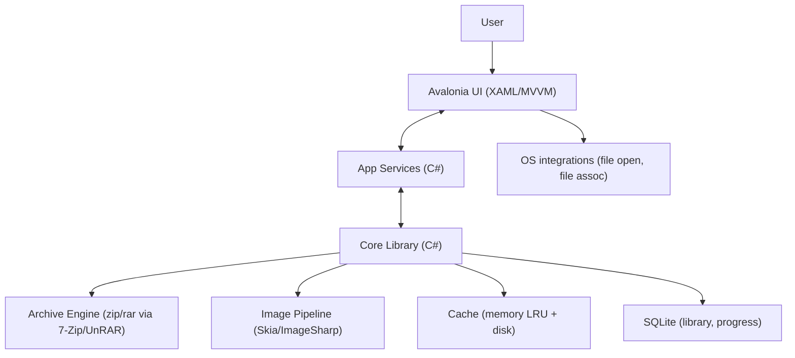
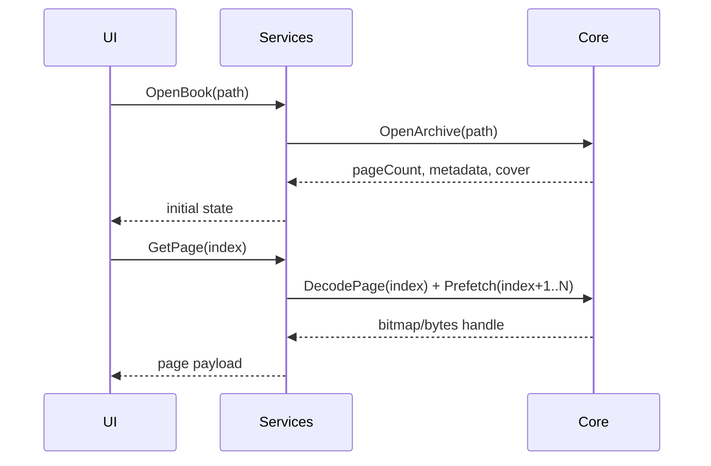

# 02 — Architecture

## Overview
Layered architecture with a C#/.NET core for performance-critical tasks, an Avalonia UI, and a thin services layer for background work.

- UI (Avalonia XAML + MVVM): rendering, gestures, user flows, accessibility
- Services (C#): commands and background operations (archive IO, prefetch)
- Core (C# libraries): archive IO, image pipeline, prefetch & cache, metadata, DB
- Storage: SQLite for library + progress; disk cache for pages & thumbnails

## Component diagram

## Key flows

### Open and read a book

### Library scan
- UI requests scan on selected folders
- Core walks directories, identifies archives, extracts `ComicInfo.xml`, generates cover thumbnails, inserts records into SQLite, emits progress updates via IProgress/events

## Core subsystems
- Archive engine: interfaces for `Open`, `List`, `Read(page)`; implementations for ZIP (System.IO.Compression/SharpCompress), RAR (7-Zip runtime or UnRAR via P/Invoke)
- Prefetcher: background worker with dynamic window size based on scroll/turn rate (Tasks + Channels)
- Cache: in-memory LRU (recent N images), disk cache for decoded/resized images and thumbnails
- Metadata: parse `ComicInfo.xml`; infer series/volume/issue when missing
- DB: normalized tables for `Series`, `Book`, `PageMeta`, `Bookmark`, `ReadingProgress` using `Microsoft.Data.Sqlite`
- Image pipeline: resize to display target; honor EXIF orientation; use Skia-backed bitmaps for rendering

## Interfaces (sketch)
- Services: `OpenBook`, `CloseBook`, `GetPage`, `Prefetch`, `ScanLibrary`, `Search`, `GetProgress`, `SetBookmark`, `SetReadingDirection`, `ListBooks`, `Recent`
- Events: `ScanProgress`, `ThumbnailReady`, `PrefetchProgress`, `ImportComplete`

## Observability
- Logging: `Serilog` with per-subsystem enrichers
- Crash reports: optional Sentry .NET, off by default
